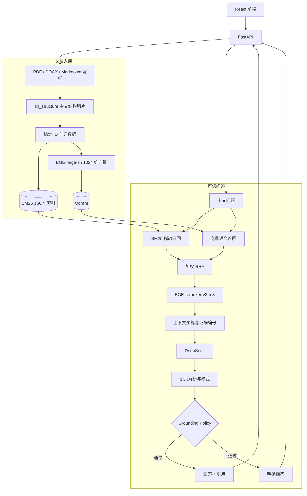
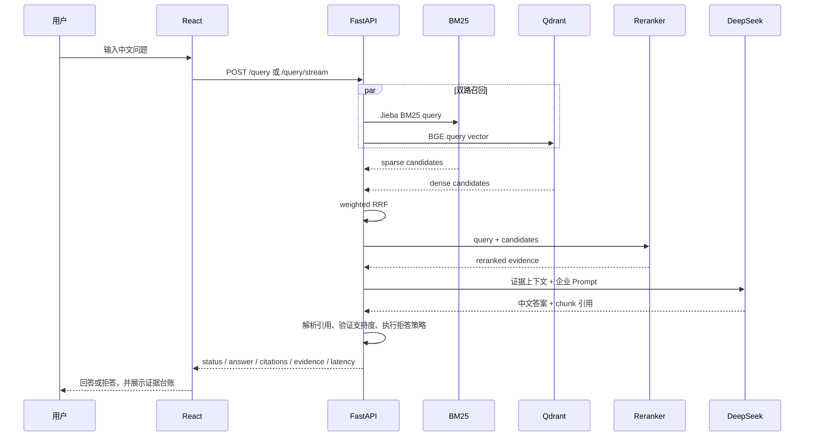

# 企业知识库可信问答：架构说明

## 1. 系统边界

系统解决的是“只依据企业文档回答，并且让答案可以回到原文核验”的问题。它不把大模型记忆当作知识源，也不把一次能回答的演示当作完成标准。

输入是 PDF、DOCX、Markdown 等文档和中文问题；输出是以下两种业务结果之一：

- `answered`：答案中的关键事实有本次召回证据支持，并附带可解析引用。
- `refused`：召回置信度不足、没有有效引用、引用支持度不足或问题超出知识库。

## 2. 总体组件



运行时由 Docker Compose 编排三个服务：

| 服务 | 作用 | 默认宿主机端口 |
| --- | --- | ---: |
| `api` | FastAPI，同时托管 React 静态资源 | 8100 |
| `qdrant` | 1024 维中文向量索引 | 16333 |
| `redis` | API 限流状态 | 16379 |

## 3. 文档入库链路

### 3.1 解析与结构切片

`src/core/document_processor.py` 统一解析文档。正式验收语料覆盖：

- `employee_handbook.pdf`
- `product_manual.docx`
- `after_sales_faq.md`

`zh_structure` 的边界优先级是章节、自然段、中文句末标点，超长内容再按长度兜底。当前配置为约 600 token、100 token 重叠。结构切片比固定字符切片更容易保留“标题—正文”的完整语义。

### 3.2 稳定 chunk ID

每个切片的核心字段包括：

```text
chunk_id
document_id
filename
file_type
page_number
section_title
chunk_index
text
content_hash
```

`chunk_id` 由文档与切片内容稳定生成。同一 ID 同时进入 BM25、Qdrant、召回结果、引用和黄金用例。它解决了两个工程问题：

1. 重复入库可以幂等更新，不会产生随机重复数据。
2. 答案引用可以从模型输出一路追溯到原始文件、页码、章节和文本。

### 3.3 双索引一致性

入库时同一批 `chunk_records` 分别进入：

- `BM25Index`：使用 Jieba 产生中文词项，并把章节、文件名等领域元数据加入可检索文本。
- `VectorDatabase`：使用 `BAAI/bge-large-zh-v1.5` 生成归一化的 1024 维向量，写入 `documents__st_bge_large_zh`。

collection 名带 Embedding profile，写入前校验向量维度，避免不同模型的向量混在同一个 collection。冻结语料最终得到 27 个切片，BM25 与 Qdrant 的 ID 集合完全一致。

## 4. 查询链路

### 4.1 两路召回

同一个问题同时进入：

- BM25：擅长 `ATLAS-X2`、`E03`、金额、天数等精确匹配。
- BGE 向量检索：擅长同义表达、语序变化和语义近似问题。

两路分数的量纲不同，不能直接相加。因此系统使用加权 Reciprocal Rank Fusion：

```text
RRF(d) = Σ weight_i / (k + rank_i(d))
```

RRF 只依赖相对名次，能稳定合并两组候选，并保留来源排名和融合分数用于调试。

### 4.2 重排与上下文预算

`BAAI/bge-reranker-v2-m3` 联合读取“问题 + 候选切片”，重新估计相关性，最终保留约 5 个证据。`ContextOptimizer` 按排序结果装入上下文，并遵守 4000 token 预算。

重排是可选项。最终消融显示：在 27 个切片的小语料上，重排没有提高 Hit@5/MRR@5，反而把 P95 从 2.72 秒提高到 10.47 秒，因此演示可以展示该能力，默认生产决策应以评测为准。

### 4.3 生成、引用和拒答

上下文为每个证据附加稳定编号及文件信息，Prompt 要求 DeepSeek：

- 只使用提供的证据；
- 为关键事实输出 `[Doc <chunk_id>]`；
- 证据不足时不要用模型常识补全。

生成后按顺序执行：

1. `CitationTracker` 把引用标记映射到本次召回切片。
2. `CitationVerifier` 检查引用是否可解析、主张与原文是否有足够支持。
3. `GroundingPolicy` 根据召回置信度、引用是否存在、引用校验结论和最低分数决定 `answered` 或 `refused`。

标准拒答文案是：

```text
当前知识库中没有足够依据回答该问题
```

拒答是正常业务结果，HTTP 请求仍然成功；真正的依赖异常、超时和配置错误才属于系统错误。

## 5. 一次请求的时序



## 6. 会话隔离与知识范围

React 页面支持三种知识范围：

- `global`：只查冻结企业示例库。
- `session`：只查当前会话上传的文件。
- `both`：对全局库和当前会话库候选按各自排名确定性交错，按稳定 chunk ID 去重后截断，避免全局 Top K 占满候选（前端文案显示为“合并检索”）。

会话文件、BM25 索引和 Qdrant collection 使用会话命名空间隔离；显式删除、TTL 过期和容量淘汰均先删除精确的 `sess_<sid>` collection 及全部 profile 后缀变体，再删除本地文件，不匹配全局冻结语料。向量清理失败时保留本地会话状态并暴露错误，以便重试而不是错误宣称隐私清理完成。

## 7. 安全与可运维性

- DeepSeek Key 只从环境变量或单次请求头进入后端，不写入日志、响应、索引和 Git。
- `docker/.env` 被忽略；仓库只提交 `docker/.env.example`。
- `DOC_PROFILE=demo` 为本地 React 演示绕过网关鉴权；默认 Compose 将 API、Qdrant、Redis 绑定到 `127.0.0.1`，这是 demo 的安全边界。`DOC_API_KEYS` 只在非 demo profile 生效，不能在保留绕过时把端口发布到 LAN/公网。
- 限流的网关 Key 客户端标识只保留 SHA-256 摘要前缀，日志和 Redis key 不含原始 Key；无 Key 时维持 IP 回退。
- Embedding 与重排模型固化到 Docker 缓存，并支持 Hugging Face offline 标志。
- `/health`、`/metrics`、结构化延迟字段和检索轨迹用于诊断。
- `scripts/docker-smoke.sh` 真实验证健康、三文件入库、有引用回答、越界拒答以及 Key 不出现在响应中。

## 8. 主要代码入口

| 文件 | 职责 |
| --- | --- |
| `src/core/document_processor.py` | 多格式解析、中文结构切片、稳定记录 |
| `src/core/bm25_index.py` | Jieba BM25 与索引持久化 |
| `src/utils/vector_factory.py` | Embedding profile 与向量库构建 |
| `src/core/hybrid_retriever.py` | 双路召回、加权 RRF、调试分数 |
| `src/core/reranker.py` | Cross-Encoder 批量重排 |
| `src/core/context_optimizer.py` | 上下文 token 预算 |
| `src/core/llm_provider.py` | DeepSeek OpenAI 兼容路由 |
| `src/core/citation_tracker.py` | 引用解析与 chunk 映射 |
| `src/core/citation_verifier.py` | 引用支持度校验 |
| `src/core/grounding_policy.py` | 回答/拒答状态机 |
| `src/core/rag_orchestrator.py` | 串联完整问答管线 |
| `src/api/main.py` | FastAPI、会话、同步/SSE 查询 |
| `evals/run_ablation.py` | 4 组配置的 120 次真实评测 |

## 9. 已知限制与演进方向

- 当前没有 OCR、复杂表格和图片理解；扫描件会缺少可用文本。
- 语料规模很小，后续需要扩大到真实企业文档并增加同义、冲突、时效性用例。
- 重排模型当前请求延迟高，可改为进程启动时常驻、批量推理或只对困难问题启用。
- 当前是演示级会话和 API Key，生产环境需要 SSO、RBAC、审计日志、租户隔离和数据保留策略。
- 文档更新目前靠重新入库；可增加版本号、增量索引、过期引用检测和回滚能力。
