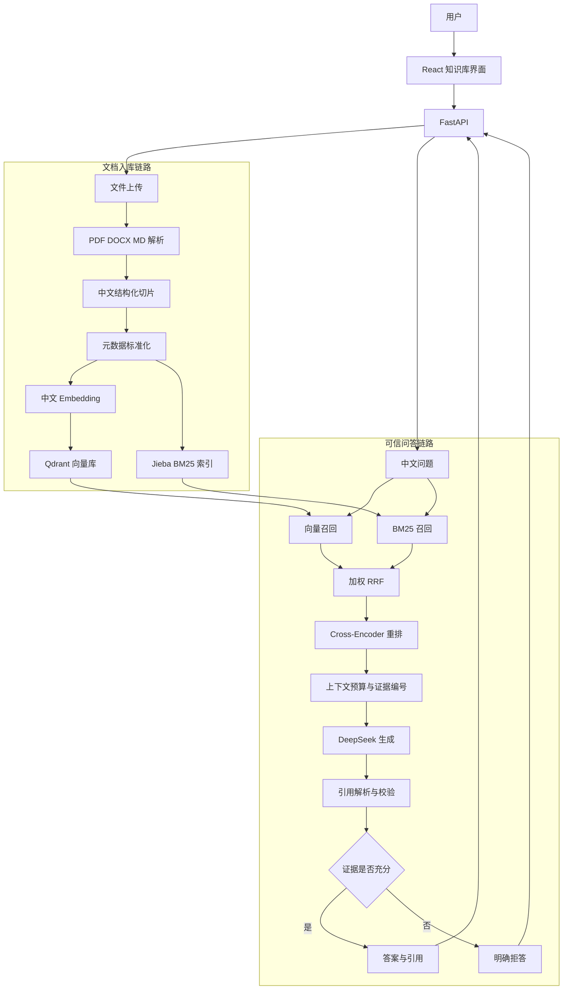

# 企业知识库可信问答系统设计

- 日期：2026-08-28
- 状态：已确认
- 开发分支：`feature/chinese-enterprise-rag`
- 开源基线：Doc-Ingestion

## 1. 项目定位

本项目面向企业内部知识查询场景，把分散在员工手册、产品说明书和售后 FAQ 中的信息整理为可检索、可问答、可核验的中文知识库。

系统不仅返回自然语言答案，还必须给出能够定位到文件、页码、章节和原文切片的引用。当知识库没有足够证据时，系统应明确拒答，而不是依赖模型常识补全答案。

项目最终要形成三个完整闭环：

1. 文档入库闭环：上传文档、解析、中文切片、向量化、建立稀疏和稠密索引。
2. 可信问答闭环：混合召回、融合、重排、生成、引用校验、证据展示和无依据拒答。
3. 质量评测闭环：30 条中文分级用例、检索与生成指标、消融对比、结果报告和参数迭代。

## 2. 目标与非目标

### 2.1 目标

- 支持 PDF、DOCX、Markdown，保留现有 TXT、HTML 兼容能力。
- 使用适合中文语义检索的 Embedding 模型，并使用 Qdrant 保存向量。
- 使用 Jieba 分词增强中文 BM25 关键词检索。
- 使用加权 RRF 融合稀疏和稠密检索结果。
- 使用中文 Cross-Encoder 对候选切片重排。
- 通过 DeepSeek 的 OpenAI 兼容接口生成中文答案。
- 为答案输出可核验的引用和原文证据。
- 对证据不足的问题执行明确、稳定的拒答策略。
- 建立 30 条中文离线评测集，输出检索、回答、引用、拒答和延迟指标。
- 完成纯向量、纯 BM25、混合检索、混合检索加重排的消融实验。
- 通过 FastAPI、React 和 Docker 提供可演示的完整应用。

### 2.2 非目标

本阶段不实现：

- 扫描件 OCR、表格还原和图片理解。
- 多租户、企业级 RBAC 和完整账号系统。
- 医疗、法律等行业专用切片策略。
- 多云 LLM 供应商矩阵；项目主路径只保留 DeepSeek。
- Streamlit 作为正式 UI。
- 知识图谱、多 Agent 协作和分布式任务队列。
- 大规模生产部署、弹性扩容和分布式向量集群。

## 3. 基线与改造边界

### 3.1 保留的基线能力

- 多格式文档解析。
- FastAPI API 和 React 前端。
- BM25 与向量双路召回框架。
- 加权 RRF、Cross-Encoder 重排和上下文预算控制。
- 引用跟踪、引用验证、SSE 流式响应。
- Docker Compose、Redis 限流和已有测试体系。
- 已有评测模块作为扩展入口。

### 3.2 需要完成的主要改造

- 新增并设为默认的 DeepSeek Provider。
- 新增中文 Embedding 配置，首选 `BAAI/bge-large-zh-v1.5`，实际维度必须从模型配置核对。
- 将正式路径统一到 Qdrant，并保留向量维度的启动和写入校验。
- 为 BM25 增加 Jieba 中文分词和领域词配置。
- 将默认重排模型替换为中文或中英双语 Cross-Encoder，并通过评测确定最终模型。
- 增加企业知识问答 Prompt、证据阈值和无依据拒答规则。
- 强化文档元数据、引用结构和前端证据面板。
- 建立中文企业文档、黄金用例、评测命令和消融报告。
- 完成中文品牌化、README、架构图、运行手册和演示截图。

## 4. 总体架构



## 5. 文档入库设计

### 5.1 输入与解析

正式验收至少覆盖 PDF、DOCX 和 Markdown。上传接口沿用基线会话模型：

- `POST /sessions`
- `GET /sessions/{sid}`
- `POST /sessions/{sid}/documents`
- `DELETE /sessions/{sid}`

现有会话隔离、文件大小限制、数量限制和重复文件处理继续保留。

### 5.2 中文切片

切片优先级：

1. 标题和章节边界。
2. 自然段边界。
3. 中文句号、问号、感叹号和分号。
4. 当结构边界无法控制长度时，使用 Token 上限兜底。

首轮参数：

- 每个切片约 400 至 600 个中文字符。
- 相邻切片重叠约 80 至 100 个字符。
- 标题或章节名以前缀形式写入切片文本。

这些参数只是初始值，最终值由 30 条评测和消融结果决定。

### 5.3 元数据

每个切片至少保存：

```text
chunk_id
document_id
filename
file_type
page_number
section_title
chunk_index
text
content_hash
```

同一个 `chunk_id` 必须同时用于 BM25、Qdrant、召回结果、引用和黄金评测集，避免引用无法回溯。

### 5.4 双索引

- 稠密索引：中文 Embedding 写入 Qdrant。
- 稀疏索引：Jieba 分词后写入 BM25。
- 两种索引都保存稳定的切片 ID 和完整引用元数据。
- Embedding 模型或维度变化时必须创建新 collection 或要求重新入库，禁止混写不同维度向量。

## 6. 查询与生成设计

### 6.1 召回

- 中文问题分别进入向量检索与 BM25。
- 两路各召回约 20 个候选，数量通过评测调整。
- BM25 负责商品型号、制度名称、金额、时间等精确词。
- 向量检索负责同义表达、自然语言改写和语义相关内容。

### 6.2 融合与重排

- 使用加权 RRF 融合两个只具有相对排名、分数量纲不同的结果集。
- 对融合候选使用中文 Cross-Encoder 重排。
- 最终保留约 5 个证据切片供生成模型使用。
- 所有中间结果保留来源、原始排名、RRF 分数和重排分数，支持调试和评测。

### 6.3 上下文与 Prompt

上下文构造器需要：

- 在模型 Token 预算内按重排顺序装入证据。
- 为每个切片生成稳定编号，例如 `[1]`、`[2]`。
- 在证据中附带文件名、页码和章节。
- 指示 DeepSeek 只依据给定证据回答。
- 指示模型为每个关键事实标注证据编号。
- 明确要求证据不足时输出标准拒答语义。

### 6.4 引用验证与拒答

引用处理分为两层：

1. 结构验证：引用编号必须存在，并映射到本次实际召回的切片。
2. 证据验证：引用切片必须与答案主张具有足够的文本或语义支持关系。

以下任一条件成立时进入拒答或降级回答：

- 没有候选切片达到最低相关性阈值。
- 关键答案主张无法绑定有效引用。
- 模型只给出常识性内容但知识库没有对应证据。
- 用户问题超出当前知识库范围。

拒答是正常产品行为，返回可识别的业务状态，不视为系统异常。

## 7. API 与前端

### 7.1 API

保留并扩展基线接口：

- `GET /health`
- `GET /metrics`
- `GET /config/llm`
- `GET /config/runtime`
- `POST /query`
- `POST /query/stream`
- 会话和文档接口

查询响应至少包含：

```text
answer
status: answered | refused
citations[]
evidence[]
retrieval_debug（仅调试模式）
latency
```

### 7.2 React 界面

正式界面包含三个区域：

1. 文档区：上传、查看当前文档、显示解析和索引状态。
2. 问答区：输入问题、展示流式回答、显示回答或拒答状态。
3. 证据区：点击引用后展示文件名、页码、章节和命中的原文片段。

界面主路径仅展示 DeepSeek 和固定的中文检索配置，隐藏与本项目无关的多供应商选择，降低演示复杂度。

## 8. 异常与安全设计

### 8.1 可预期异常

- 不支持或为空的文档：拒绝入库并返回具体文件级错误。
- 解析失败：保留其他文件结果，并标记失败文件。
- Embedding 服务不可用：停止写入，禁止生成半成品索引。
- 向量维度不匹配：快速失败并提示重新建立 collection。
- Qdrant 或 Redis 不可用：健康检查返回降级或失败状态。
- DeepSeek 超时、限流或服务错误：通过统一 Provider 异常转换为可读错误；SSE 发送终止事件。
- 引用不存在：禁止直接把模型生成的伪引用返回给用户。

### 8.2 安全与隐私

- API Key 只从环境变量或本地未跟踪的 `.env` 读取。
- 日志和评测报告不得包含 API Key。
- 上传文件限制类型、大小、数量和路径，沿用随机会话目录和文件名清理逻辑。
- 演示知识库全部使用自建模拟资料，不包含真实员工或客户隐私。
- README 明确说明开源基线和新增实现，保留许可证与必要署名。

## 9. 30 条评测设计

### 9.1 评测语料

- 员工手册：考勤、请假、报销、入职和培训。
- 两份产品说明书：规格、使用方法、故障处理和保修。
- 售后 FAQ：退换货、物流、维修和发票。

语料保存在版本控制下的评测目录中，不包含隐私信息。

### 9.2 用例分级

| 难度 | 数量 | 主要能力 |
| --- | ---: | --- |
| Easy | 10 | 单文档、单切片事实检索 |
| Medium | 10 | 同义表达、专业词、跨章节和文档选择 |
| Hard | 10 | 多文档对比、多证据组合、歧义和无答案拒答 |

Hard 用例中包含约 5 条知识库无法回答的问题。

每条用例至少包含：

```text
id
difficulty
category
question
answerable
required_facts
gold_document_ids
gold_chunk_ids
reference_answer
```

### 9.3 指标

- `Hit@5`：前五名是否命中至少一个黄金切片。
- `MRR@5`：第一个黄金切片排名的倒数均值。
- 答案要点覆盖率：回答是否覆盖 `required_facts`。
- 引用解析成功率：引用是否能映射到本次检索的真实切片。
- 引用准确率：被引用证据是否属于黄金证据或能够直接支持主张。
- 拒答准确率：不可回答问题是否正确拒答。
- 检索延迟与端到端延迟：分别统计 P50 和 P95。

答案评测优先采用确定性的关键事实和黄金证据规则。可额外运行 LLM Judge，但必须单独展示，不能用它替代可复现指标。

### 9.4 消融实验

在相同语料和问题上比较：

1. 纯向量检索。
2. 纯 BM25 检索。
3. BM25 + 向量 + RRF。
4. BM25 + 向量 + RRF + Cross-Encoder。

报告需要同时展示整体和 Easy、Medium、Hard 分层结果，以便说明混合检索和重排分别解决了什么问题。

## 10. 验收标准

- 30 条用例能够完整执行并输出版本化报告。
- 目标 `Hit@5 >= 90%`。
- 目标 `MRR@5 >= 0.75`。
- 目标引用解析成功率为 `100%`。
- 目标引用准确率不低于 `90%`。
- 目标不可回答问题拒答准确率不低于 `80%`。
- PDF、DOCX、Markdown 均能完成解析和入库。
- 前端可展示答案、引用来源和原文证据。
- DeepSeek 超时、Embedding 异常、空文档等情况有明确错误。
- 新增测试与已有测试全部通过。
- Ruff、前端类型检查、前端测试、前端构建和 Docker 冒烟测试通过。
- 不把目标值当作实际成绩；README 和简历只写最终实测结果。

## 11. 测试策略

- 单元测试：中文切片、Jieba 分词、RRF、证据阈值、引用解析、拒答策略、配置和 Provider 异常。
- 集成测试：文件上传到双索引、查询到引用响应、SSE 正常与异常终止、Qdrant 维度校验。
- 前端测试：上传状态、回答状态、拒答状态、引用点击和证据面板。
- 回归测试：已有 API、会话隔离、限流、指标和配置测试不得退化。
- 真实冒烟测试：Docker 启动后上传三类文件，执行可回答与不可回答问题。
- 离线评测：30 条分层用例和四组消融配置。

## 12. 实施顺序

1. 运行并记录基线：依赖、测试、前端构建、Docker 和示例问答。
2. 绘制真实代码调用链，确认需要修改的边界。
3. 先以测试驱动方式接入 DeepSeek Provider。
4. 实现中文 Embedding 配置与 Qdrant 正式路径。
5. 实现中文结构化切片、Jieba BM25 和领域词配置。
6. 调整 RRF 和中文 Cross-Encoder 重排。
7. 实现企业问答 Prompt、引用验证、拒答策略和证据面板。
8. 创建中文语料与 30 条黄金用例。
9. 运行消融评测，根据结果调参，并冻结最终配置。
10. 完成测试、Docker、README、架构图、截图和运行手册。
11. 推送分支、创建 PR，再依据实测结果整理简历描述和面试讲稿。

## 13. 项目完成后的可讲述闭环

```text
企业文档上传
-> 多格式解析
-> 中文结构化切片
-> 中文 Embedding + Qdrant / Jieba BM25 双索引
-> 向量与关键词双路召回
-> 加权 RRF 融合
-> 中文 Cross-Encoder 重排
-> 上下文预算与证据编号
-> DeepSeek 生成
-> 引用校验与证据展示
-> 无依据拒答
-> 30 条离线评测与四组消融实验
```

该闭环既覆盖 RAG 的核心技术路径，也能用可复现评测说明每项增强的实际价值。
