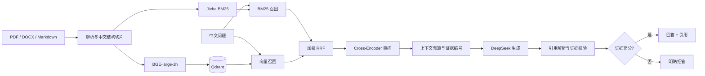
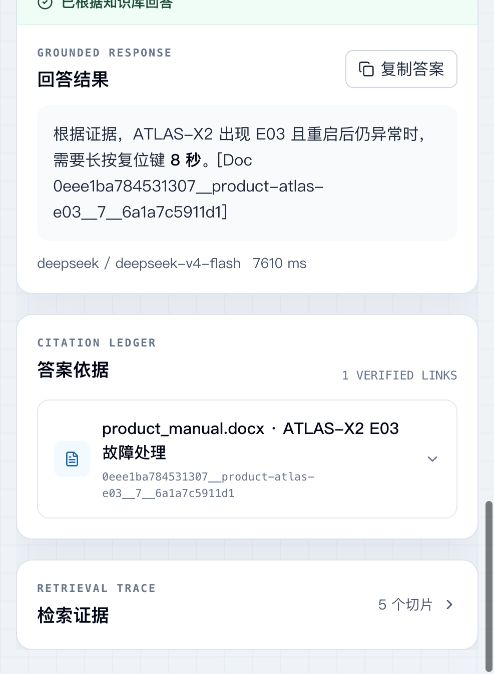
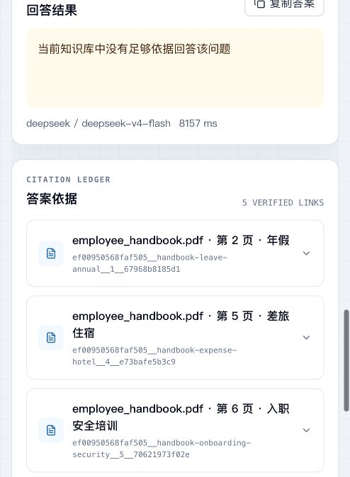

# 企业知识库可信问答系统

面向中文企业文档的端到端 RAG 应用：把员工手册、产品说明书和售后 FAQ 解析入库，通过 **Jieba BM25 + BGE-large-zh + 加权 RRF + Cross-Encoder** 检索证据，再由 **DeepSeek** 生成带可核验引用的中文回答；知识库没有依据时明确拒答。

本项目基于开源项目 [vampokala/Doc-Ingestion](https://github.com/vampokala/Doc-Ingestion) 二次开发。文末区分了上游能力与本分支的中文企业场景改造。

## 三个完整闭环

1. **文档入库**：解析 → 中文结构切片 → 稀疏/稠密双索引 → 稳定 chunk ID。
2. **可信问答**：双路召回 → RRF 融合 → 重排 → DeepSeek 生成 → 引用校验 → 回答或拒答。
3. **质量评测**：30 条中文分级用例 × 4 组配置，共 120 次真实执行，量化检索、答案、引用、拒答和延迟。

## 核心能力与技术栈

- 正式验收支持 **PDF、DOCX、Markdown**，保留 TXT、HTML 兼容能力。
- `zh_structure` 按章节、自然段和中文标点切片，保留文件名、页码、章节、序号与内容哈希。
- `BAAI/bge-large-zh-v1.5` + Qdrant 构建中文语义索引。
- Jieba BM25 召回型号、金额、期限等精确词；加权 RRF 融合稀疏与稠密排名。
- `BAAI/bge-reranker-v2-m3` 可选重排，DeepSeek OpenAI 兼容接口负责中文生成。
- 引用绑定稳定 chunk ID；校验失败、证据不足或问题越界时返回 `refused`。
- React 展示回答、引用台账与检索证据；FastAPI 提供同步和 SSE 接口；Docker Compose 编排 API、Redis、Qdrant。

## 端到端架构



组件职责、数据结构和请求时序见 [中文架构说明](Docs/ARCHITECTURE-ZH.md)。

## 实测界面

| 有依据回答 | 无依据拒答 |
| --- | --- |
|  |  |

左图问题为“ATLAS-X2 出现 E03 且重启后仍异常，要长按复位键多久？”，系统回答“8 秒”并绑定 `product_manual.docx` 的稳定 chunk ID。右图询问文档未提供的年度奖金，系统返回“当前知识库中没有足够依据回答该问题”。

## 30 条用例、120 次真实评测

评测日期：2026-08-29；生成模型：`deepseek/deepseek-v4-flash`；冻结语料：3 个文件、27 个稳定切片；用例：Easy / Medium / Hard 各 10 条，其中 25 条可回答、5 条应拒答。

| 配置 | Hit@5 | MRR@5 | 事实覆盖 | 引用解析 | 引用准确 | 拒答准确 | 执行成功 | P50 | P95 |
| --- | ---: | ---: | ---: | ---: | ---: | ---: | ---: | ---: | ---: |
| BM25 | 100% | 100% | 87% | 100% | 97.73% | 90% | 100% | 1.13s | 1.80s |
| Vector | 100% | 96% | 89% | 100% | 100% | 93.33% | 100% | 1.39s | 2.20s |
| Hybrid | 100% | 100% | **92%** | 100% | 98.55% | **93.33%** | 100% | 1.42s | 2.72s |
| Hybrid + Rerank | 100% | 100% | 88% | 100% | 96.97% | 90% | 100% | 8.73s | 10.47s |

在 27 切片的小语料上，**Hybrid 是效果与延迟更平衡的默认方案**。重排没有继续提升 Hit@5 或 MRR@5，却把 P95 提高到 10.47 秒；因此组件是否启用要由消融数据决定，而不是默认“越多越好”。

指标口径、分级结果、失败分析和复现实验命令见 [评测说明](Docs/EVALUATION-ZH.md)，冻结报告见 `evals/reports/final/enterprise-final.{json,md}`。

## Docker 快速启动

需要 Docker Desktop。默认端口为应用 `8100`、Qdrant `16333`、Redis `16379`，不会占用第一个项目的端口。

```bash
git clone <你的 GitHub 仓库地址>
cd enterprise-knowledge-rag
cp docker/.env.example docker/.env
```

仅在本机编辑 `docker/.env`：

```dotenv
DEEPSEEK_API_KEY=你的 DeepSeek API Key
DEEPSEEK_BASE_URL=https://api.deepseek.com
```

`docker/.env` 已被 Git 忽略，不要把真实 Key 写进文档、配置或提交记录。

```bash
docker compose --env-file docker/.env -f docker/docker-compose.yml up -d --build
docker compose --env-file docker/.env -f docker/docker-compose.yml ps
```

首次构建会下载并固化 BGE Embedding 与重排模型。服务健康后访问 `http://127.0.0.1:8100`。

入库冻结语料：

```bash
docker compose --env-file docker/.env -f docker/docker-compose.yml exec api \
  python -m src.ingest \
  --docs evals/corpus/generated \
  --chunk-strategy zh_structure \
  --embedding-profile st_bge_large_zh
```

稳定 chunk ID 使重复执行保持幂等。随后可在 React 页面创建会话并提问。

运行真实回答/拒答冒烟测试：

```bash
set -a
source docker/.env
set +a
./scripts/docker-smoke.sh
```

完整启动、评测、停机和排障命令见 [运行手册](Docs/RUNBOOK.md)。

## 本地开发与验证

```bash
python3 -m venv .venv
.venv/bin/pip install -r requirements/base.txt -r requirements/eval.txt
PYTHONPATH=. .venv/bin/python -m pytest tests -q
.venv/bin/python -m ruff check src tests evals scripts

cd frontend
npm install
npm test
npm run typecheck
npm run lint
npm run build
```

## 项目目录

```text
frontend/                  React 可信问答界面
src/api/                   FastAPI、会话、流式响应
src/core/                  解析、检索、重排、生成、引用与拒答
src/evaluation/            企业评测指标
evals/corpus/generated/    三份冻结中文企业语料
evals/datasets/            30 条分级用例
evals/reports/final/       120 次执行的冻结报告
docker/                    Compose 与环境变量模板
Docs/                      架构、评测、运行与面试说明
```

## 开源基线与本项目改造

上游提供了多格式解析、FastAPI/React、BM25/向量召回框架、RRF、重排、引用与 Docker 等通用能力。本分支围绕中文企业问答完成：

- DeepSeek Provider、模型白名单、同步/流式路径与密钥边界。
- `zh_structure` 中文切片、稳定 chunk ID、页码/章节/哈希元数据。
- Jieba BM25、BGE-large-zh、Qdrant collection 隔离与维度校验。
- 中文重排、企业证据 Prompt、引用校验与结构化拒答策略。
- 中文 React 界面、知识库范围选择、证据台账与检索轨迹。
- 30 条三级黄金用例、4 组消融、120 次真实 DeepSeek 执行与指标分母修正。
- 冲突端口 Docker 栈、离线模型缓存、回答/拒答冒烟脚本。

## 当前限制

- 语料只有 3 个文件、27 个切片，评测验证的是工程闭环，不代表大规模生产效果。
- 未实现扫描件 OCR、复杂表格还原、图片理解、多租户 RBAC 和分布式 Qdrant。
- Cross-Encoder 当前带来明显延迟；生产化应常驻加载、批处理或按查询难度路由。
- DeepSeek 是外部生成服务；离线模式只覆盖 Embedding 与重排模型。

## 深入阅读

- [中文架构说明](Docs/ARCHITECTURE-ZH.md)
- [运行手册](Docs/RUNBOOK.md)
- [评测与消融](Docs/EVALUATION-ZH.md)
- [面试讲解与高频追问](Docs/INTERVIEW-NOTES-ZH.md)

## License

延续上游项目的 MIT License。使用或二次开发时请保留相应许可与来源说明。
